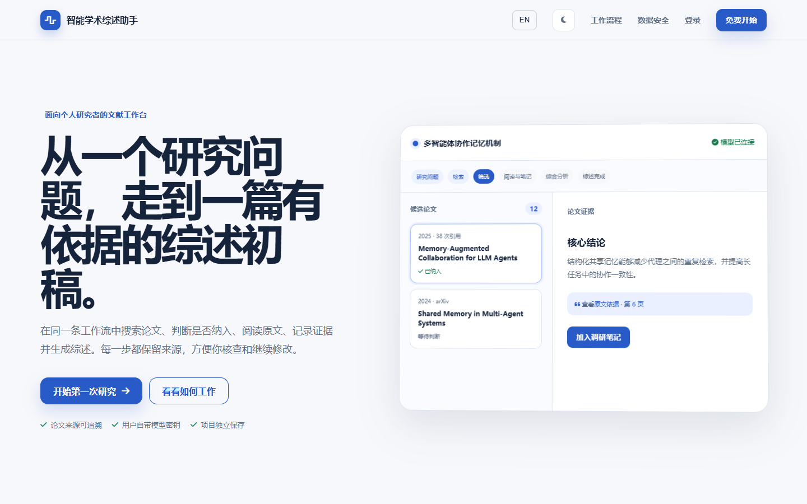
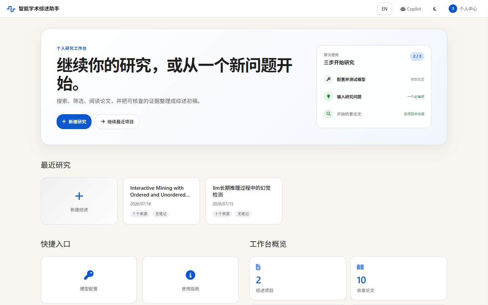
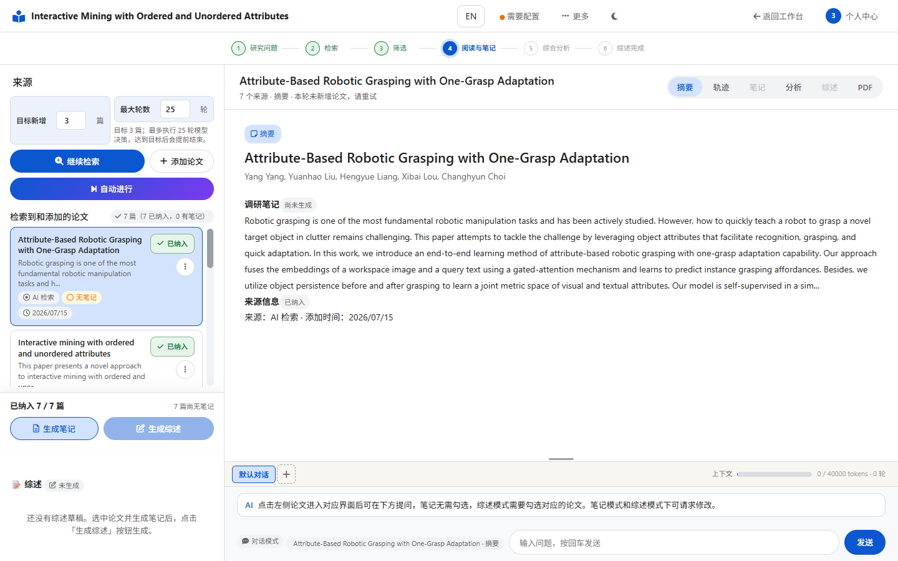
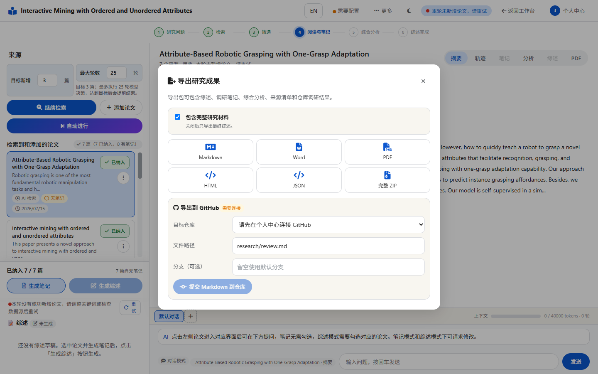
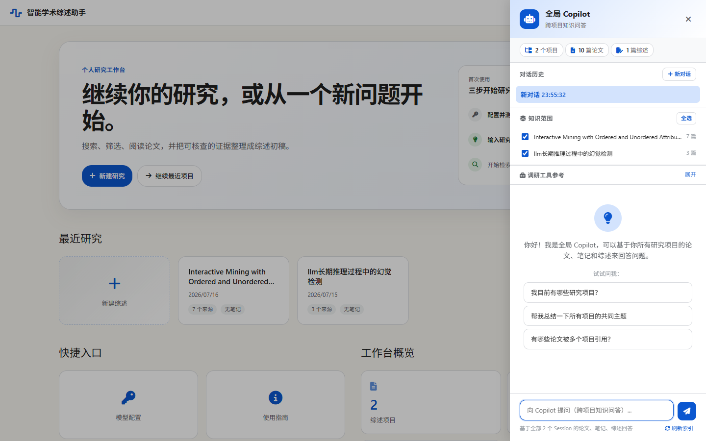
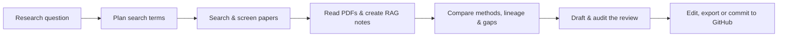

<div align="center">

[English](README.md) · [简体中文](README.zh-CN.md)

# Academic Research Agent

### Turn a research question into an evidence-grounded literature review.

Search, screen, read, synthesize, and write in one traceable AI research workspace.

[](https://academic-research-agent-two.vercel.app)
[](https://github.com/lajoyazyh/academic-research-agent/actions/workflows/ci.yml)
[](LICENSE)

[Try the live product](https://academic-research-agent-two.vercel.app) ·
[Quick start](#quick-start) ·
[Deployment guide](DEPLOYMENT.md) ·
[Report an issue](https://github.com/lajoyazyh/academic-research-agent/issues)

</div>



## Why this project?

Literature reviews are rarely a single prompt. Researchers need to discover the right papers, decide what belongs, inspect the evidence, compare findings, track citations, and revise the final narrative.

Academic Research Agent turns that process into an editable workspace. Every stage remains visible and every artifact can be reviewed before it feeds the next step.

| Research need | What the product provides |
| --- | --- |
| Discover relevant work | Agentic search across arXiv, Crossref, OpenAlex, and Semantic Scholar |
| Keep sources trustworthy | Stable source IDs, inclusion decisions, citation auditing, and deterministic references |
| Read beyond metadata | PDF ingestion plus RAG notes from abstracts or full text |
| Understand a field | Comparison, research-lineage, and gap-analysis cards |
| Produce a useful draft | Editable Markdown review with evidence-quality indicators |
| Stay in control | Manual checkpoints or one-click automation, with tool traces and fallback visibility |
| Reuse the work | Cross-project Copilot and export to Markdown, Word, PDF, HTML, JSON, or ZIP |

## Product tour

### 1. Research dashboard



Start a new question or continue an existing workspace from one place. The dashboard keeps recent projects, onboarding progress, shortcuts, activity, and workspace statistics together so returning researchers can immediately see where to continue.

### 2. Evidence-centered research workbench



The main workbench follows six explicit stages: research question, search, screening, reading and notes, synthesis, and review. Sources and inclusion decisions stay on the left; paper evidence, traces, notes, analysis, review, and PDF views share the central editor; contextual chat remains available without leaving the project.

### 3. Portable research outputs



Export only the final review or package the complete research record—including notes, analysis, sources, and repository findings—as Markdown, Word, PDF, HTML, JSON, or ZIP. GitHub-connected users can commit the Markdown output directly to a selected repository and branch.

### 4. Cross-project Copilot



Select one or more workspaces as the knowledge scope, then ask questions across their papers, notes, and reviews. The sidebar also exposes conversation history, index refresh, and optional research-tool context.

## From question to review



Use the guided workflow when you want to curate each decision, or run the complete pipeline for a fast first pass. Intermediate notes, analysis cards, and drafts stay editable in both modes.

### Expected runtime

The default search round targets only three new unique candidate records. The 100, 300, and 500 candidate caps used by review modes are safety boundaries, not mandatory per-run targets. With an available provider and responsive sources, a search round typically takes 3–10 minutes; a rapid first draft based on about five included papers takes 10–20 minutes; and an 8–12-paper rapid evidence review takes 20–35 minutes. Free or rate-limited providers can roughly double those ranges, but completed checkpoints remain recoverable. A strict systematic review involves at least 100 candidates, two-stage screening, and human checkpoints, so it is a background research task rather than an instant request.

## Product highlights

- **Evidence-first writing** — claims stay connected to source records, with source coverage and citation-quality checks.
- **Agentic literature search** — planning, tool use, retry logic, quality gates, and fallback paths are visible rather than hidden.
- **RAG research notes** — structured notes use PDF text when available and fall back safely to abstracts.
- **Bring your own key** — use Zhipu AI, OpenAI, or another OpenAI-compatible provider without storing request keys on the server.
- **Custom research strategies** — configure search, note-taking, and review-writing Skills per workspace.
- **GitHub research workflow** — inspect public or authorized private repositories and commit selected research artifacts.
- **Built for real work** — responsive UI, persistent multi-user workspaces, Markdown editing, and portable exports.
- **Chinese and English UI** — switch languages directly in the product.

## Quick start

### Run locally

Requirements: Python 3.11+ and a supported model API key.

```bash
git clone https://github.com/lajoyazyh/academic-research-agent.git
cd academic-research-agent

python -m venv .venv
```

Activate the environment:

```powershell
# Windows PowerShell
.\.venv\Scripts\Activate.ps1
```

```bash
# macOS / Linux
source .venv/bin/activate
```

Install and start:

```bash
python -m pip install -r requirements.txt
python -m uvicorn web_app:app --app-dir agent --host 127.0.0.1 --port 8000
```

Open [http://127.0.0.1:8000](http://127.0.0.1:8000).

You can configure a provider in **Profile → Model API** after opening the app. For private local use, you may instead copy `.env.example` to `.env` and set a server-side fallback key.

### Run with Docker

```bash
docker compose up --build
```

Then open [http://127.0.0.1:8000](http://127.0.0.1:8000).

## Architecture

```text
Browser
  ├─ Static responsive UI + Markdown workspace
  ├─ Supabase Auth
  └─ Request-scoped BYOK credentials
             │
             ▼
FastAPI backend
  ├─ Plan / ReAct / Reflexion agent loop
  ├─ Academic search and PDF tools
  ├─ RAG notes, analysis, review, and export
  └─ Background run recovery and observability
             │
             ▼
Supabase Postgres + private Storage
```

The production setup serves the frontend on Vercel and the long-running FastAPI agent on a Docker host, with Supabase providing authentication and workspace persistence. The app also supports a local, single-user filesystem mode.

## Privacy and BYOK

Public deployments are designed for bring-your-own-key usage:

- model keys are sent only with model-related requests;
- the backend uses them in memory and does not persist them in sessions, traces, notes, reviews, or analytics;
- browser storage is opt-in: session-only by default, with an explicit “remember” option;
- GitHub provider tokens remain browser-scoped and are sent only for explicit repository or export actions.

Never commit `.env`, API keys, tokens, downloaded papers, or generated sessions. See [SECURITY.md](SECURITY.md) for the full security model.

## Development

Run the test suite:

```bash
python -m pytest tests -q
```

Build the static frontend:

```bash
npm run build
```

Repository map:

```text
academic-research-agent/
├── agent/          # FastAPI backend, agent pipeline, tools, and frontend
├── docs/           # Product, API, architecture, and migration notes
├── evaluation/     # Optional evaluation runner and scoring utilities
├── scripts/        # Frontend build scripts
├── supabase/       # Database migrations
├── tests/          # Pytest suite
├── Dockerfile
└── DEPLOYMENT.md
```

## Documentation

- [Deployment guide](DEPLOYMENT.md)
- [Requirements (Chinese)](docs/Agent需求文档.md)
- [System design (Chinese)](docs/Agent详细设计文档.md)
- [API reference (Chinese)](docs/API接口文档.md)
- [Architecture analysis (Chinese)](docs/项目架构分析.md)
- [Evaluation toolkit](evaluation/README.md)

## Contributing

Ideas, bug reports, and pull requests are welcome. Please [open an issue](https://github.com/lajoyazyh/academic-research-agent/issues) with a reproducible description and never include private research data or credentials.

If this project is useful to you, consider giving it a ⭐ — it helps more researchers discover the project.

## License

Released under the [MIT License](LICENSE).
