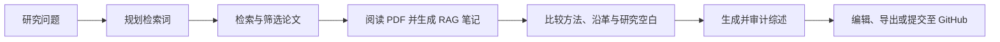

<div align="center">

[English](README.md) · [简体中文](README.zh-CN.md)

# Academic Research Agent

### 从一个研究问题，走到一篇有依据的综述初稿。

在一个可追溯的 AI 研究工作台中，完成检索、筛选、阅读、综合与写作。

[](https://academic-research-agent-two.vercel.app)
[](https://github.com/lajoyazyh/academic-research-agent/actions/workflows/ci.yml)
[](LICENSE)

[在线体验](https://academic-research-agent-two.vercel.app) ·
[快速开始](#快速开始) ·
[部署指南](DEPLOYMENT.md) ·
[反馈问题](https://github.com/lajoyazyh/academic-research-agent/issues)

</div>


## 为什么做这个项目？

文献综述很少能靠一个提示词完成。研究者需要找到合适的论文、判断是否纳入、核查原文证据、比较不同结论、管理引用，并持续修改最终叙述。

Academic Research Agent 将这套过程变成一个可编辑的研究工作台。每个阶段都清晰可见，每份中间产物都可以在进入下一步前由你检查和修改。

| 研究需求 | 产品能力 |
| --- | --- |
| 发现相关研究 | 通过 arXiv、Crossref、OpenAlex 和 Semantic Scholar 进行智能检索 |
| 保证来源可信 | 稳定来源 ID、纳入决策、引用审计与确定性参考文献 |
| 深入阅读内容 | PDF 解析，以及基于摘要或全文的 RAG 笔记 |
| 理解领域脉络 | 方法对比、研究沿革与研究空白分析卡片 |
| 产出可用初稿 | 可编辑的 Markdown 综述与证据质量指标 |
| 保持过程可控 | 人工检查点或一键自动化，并展示工具调用与回退路径 |
| 复用研究成果 | 跨项目 Copilot，以及 Markdown、Word、PDF、HTML、JSON、ZIP 导出 |

## 产品界面导览

### 1. 个人研究工作台


在一个页面中创建新研究或继续已有项目。工作台集中展示最近研究、首次使用引导、快捷入口、活动记录和整体统计，让用户再次进入时可以立即找到下一步。

### 2. 以证据为中心的研究控制台


主工作台将研究过程拆分为六个明确阶段：研究问题、检索、筛选、阅读与笔记、综合分析和综述完成。左侧管理来源与纳入决策；中央区域统一展示论文证据、运行轨迹、笔记、分析、综述和 PDF；底部对话区让用户无需离开项目即可基于当前上下文继续提问。

### 3. 可移植的研究成果


既可以只导出最终综述，也可以将笔记、分析、来源与仓库调研结果打包成完整研究档案。支持 Markdown、Word、PDF、HTML、JSON 和 ZIP；连接 GitHub 后，还能把 Markdown 成果直接提交到指定仓库和分支。

### 4. 跨项目 Copilot


选择一个或多个研究项目作为知识范围，即可跨论文、笔记和综述提问。侧边栏同时提供对话历史、索引刷新和可选调研工具上下文。

## 从问题到综述



你可以使用引导式流程逐项确认，也可以运行完整流水线快速得到第一版结果。无论哪种模式，笔记、分析卡片和综述草稿都可以继续编辑。

### 运行时长预期

默认的一轮检索只要求新增 3 篇唯一候选论文；综述模式中的 100、300、500 条候选上限是安全边界，不是每次任务的必达目标。模型和数据源可用时，单轮检索通常需要 3–10 分钟；纳入约 5 篇论文的快速初稿通常需要 10–20 分钟；纳入 8–12 篇的快速证据综述通常需要 20–35 分钟。免费或受限模型发生限流时，耗时可能增加约一倍，但任务应保留进度并可恢复。严格系统综述涉及至少 100 条候选、两阶段筛选和人工检查点，应作为后台长任务，而不是即时请求。

## 产品亮点

- **证据优先写作** — 论断与来源记录保持关联，并提供来源覆盖率和引用质量检查。
- **智能文献检索** — 规划、工具调用、重试、质量门槛和回退路径都清晰可见。
- **RAG 研究笔记** — 优先使用 PDF 全文生成结构化笔记，无法获得全文时安全回退至摘要。
- **自带模型密钥** — 支持智谱 AI、OpenAI 及其他 OpenAI 兼容服务，请求密钥不会被服务端持久化。
- **自定义研究策略** — 可为每个工作区配置检索、笔记和综述写作 Skill。
- **GitHub 研究工作流** — 分析公开或已授权的私有仓库，并将选定成果直接提交到 GitHub。
- **面向真实研究场景** — 响应式界面、多用户持久化工作区、Markdown 编辑与多格式导出。
- **中英文界面** — 可在产品内直接切换语言。

## 快速开始

### 本地运行

环境要求：Python 3.11+，以及受支持的模型 API Key。

```bash
git clone https://github.com/lajoyazyh/academic-research-agent.git
cd academic-research-agent

python -m venv .venv
```

激活虚拟环境：

```powershell
# Windows PowerShell
.\.venv\Scripts\Activate.ps1
```

```bash
# macOS / Linux
source .venv/bin/activate
```

安装并启动：

```bash
python -m pip install -r requirements.txt
python -m uvicorn web_app:app --app-dir agent --host 127.0.0.1 --port 8000
```

打开 [http://127.0.0.1:8000](http://127.0.0.1:8000)。

进入应用后，可在 **个人中心 → 模型 API** 中配置服务商。若仅供本地私用，也可以将 `.env.example` 复制为 `.env`，并设置服务端备用密钥。

### 使用 Docker

```bash
docker compose up --build
```

然后打开 [http://127.0.0.1:8000](http://127.0.0.1:8000)。

## 系统架构

```text
浏览器
  ├─ 响应式静态界面 + Markdown 工作台
  ├─ Supabase Auth
  └─ 仅随请求发送的 BYOK 凭据
             │
             ▼
FastAPI 后端
  ├─ Plan / ReAct / Reflexion Agent 循环
  ├─ 学术检索与 PDF 工具
  ├─ RAG 笔记、分析、综述与导出
  └─ 后台任务恢复与可观测性
             │
             ▼
Supabase Postgres + 私有 Storage
```

生产环境由 Vercel 托管前端，Docker 主机运行长任务 FastAPI Agent，Supabase 提供身份认证与工作区持久化。同时，项目也支持本地单用户文件存储模式。

## 隐私与 BYOK

公开部署面向“用户自带密钥”场景设计：

- 模型密钥只随模型相关请求发送；
- 后端仅在内存中使用密钥，不会将其写入会话、调用轨迹、笔记、综述或分析事件；
- 浏览器默认只在当前会话保存，用户明确选择后才会长期记住；
- GitHub Provider Token 保留在浏览器侧，仅在用户明确执行仓库读取或导出操作时发送。

请勿提交 `.env`、API Key、Token、下载的论文或运行生成的会话。完整安全模型请参阅 [SECURITY.md](SECURITY.md)。

## 开发与测试

运行测试：

```bash
python -m pytest tests -q
```

构建静态前端：

```bash
npm run build
```

仓库结构：

```text
academic-research-agent/
├── agent/          # FastAPI 后端、Agent 流水线、工具与前端
├── docs/           # 产品、API、架构与迁移文档
├── evaluation/     # 可选评测运行器与评分工具
├── scripts/        # 前端构建脚本
├── supabase/       # 数据库迁移
├── tests/          # Pytest 测试
├── Dockerfile
└── DEPLOYMENT.md
```

## 项目文档

- [部署指南](DEPLOYMENT.md)
- [需求文档](docs/Agent需求文档.md)
- [系统详细设计](docs/Agent详细设计文档.md)
- [API 接口文档](docs/API接口文档.md)
- [项目架构分析](docs/项目架构分析.md)
- [评测工具](evaluation/README.md)

## 参与贡献

欢迎提交建议、Bug 反馈和 Pull Request。请通过 [GitHub Issues](https://github.com/lajoyazyh/academic-research-agent/issues) 提供可复现的信息，并注意不要附带私密研究数据或任何凭据。

如果这个项目对你有帮助，欢迎点一个 ⭐，让更多研究者发现它。

## 开源许可

本项目基于 [MIT License](LICENSE) 开源。
