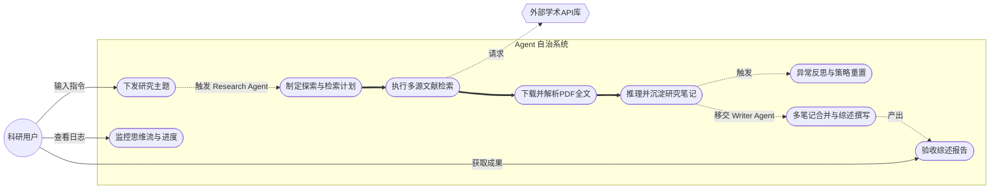

# Agent 需求规格说明书 (Requirements Document)

## 1. 引言
### 1.1 编写目的
本文档旨在全面且详尽地定义面向学术科研的自动化大语言模型代理（Academic Research Agent）的需求规格。供架构师、开发人员、测试人员及项目评审参考，确保在“迭代二”阶段交付的 Agent 系统满足复杂学术流程自动化的指标要求。

### 1.2 项目背景与痛点
软件工程与前沿学术研究中，科研人员每天面临海量论文筛选。传统流程重度依赖人工完成“检索-筛选-泛读-精读-笔记-综述撰写”的链路。
现有的单步 LLM 问答由于上下文窗口限制与缺乏探索验证循环，无法独立完成深度调研。因此，本项目需要一个能长时运行、自主规划且具备反思能力的 Agent 来接管繁密的知识检索过程。

### 1.3 核心术语
- **ReAct**：Reasoning and Acting，大模型同时执行思维链推理与外部环境动作的框架。
- **Reflexion**：大模型对产生的错误、幻觉或无明显进展状态进行自我反省的技术。

### 1.4 涉众分析 (Stakeholder Analysis)
为了保证系统满足各方诉求，对涉及本项目的主要干系人进行如下分析：
1. **科研人员/最终用户 (Primary Users)** 
   - **特征**：具备学术背景，但可能不具备编程能力；需要处理大量学术文献。
   - **核心诉求**：极简的交互方式（“一句话指令”）；高价值且准确的交付物（结构化综述、本地 PDF）；等待时间在可接受范围（10~30 分钟）并期望不被打断。
2. **系统开发与维护团队 (Developers & Maintainers)**
   - **特征**：负责大模型 Agent 架构开发、API 对接、错误处理。
   - **核心诉求**：系统模块需高内聚低耦合；各个组件（如检索、解析、总结）便于扩展和调试；拥有清晰的日志记录用于评估底层运行情况。
3. **项目评估与审查专家 (Evaluators/Reviewers)**
   - **特征**：关注该 Agent 项目最终落地的能力与 AI 推理路径的合理性。
   - **核心诉求**：能够可视化地观察到 Agent 的思考流和工具调用轨迹（Thought -> Action -> Observation），以判断过程质量。
4. **外部数据/算力供应商 (External API Providers)**
   - **特征**：提供学术数据（如 arXiv、Semantic Scholar）或大模型算力（如 Zhipu GLM-4、OpenAI）。
   - **核心诉求**：系统的请求频率需遵守服务商的速率限制（Rate Limits）与合规性要求，不进行恶意爬取。

## 2. 项目前景与范围 (Vision and Scope)
### 2.1 业务愿景
打造一个高自治、可交付万字级结构化内容的学术代理框架。未来的演进将从单纯的“检索与总结”向“学术启发与创新点挖掘”延伸，彻底将科研人员从枯燥的前期查阅工作中解放出来。

### 2.2 项目范围与业务边界
- **纳入范围 (In Scope)**：系统覆盖文献检索、摘要初筛、PDF 下载与清洗、基于长下文阅读的学术笔记沉淀，以及撰写特定格式的结构化文献综述。
- **排除范围 (Out of Scope)**：系统并不负责进行真实的数据实验或假设验证，暂不支持对学术图表中的矢量数据进行深度图像分割解析。

### 2.3 目标模型边界 (Target Models)
本系统在实现时需明确支持的底层大语言模型运行边界与扩展性：
- **云端服务/商业大模型**：优先支持智谱 GLM-4 系列（作为本次迭代和国产化适配测试的主要基准），全面兼容 OpenAI GPT-4o 系列及 Anthropic Claude 3.5。
- **开源/本地部署模型**：在未来考虑到科研数据保密性，架构须解耦并支持通过 Ollama 或 vLLM 兼容本地启动的大规模上下文模型（如 Llama 3 大规模窗口版或 Qwen 系列）。

## 3. 总体描述
### 3.1 产品概述
本系统是一个以命令行与 Web UI 双端驱动的自治代理应用。给定任意一个极具深度的研究主题（如“大模型在多智能体系统中的应用”），Agent 将自主发散搜索策略，跨库查阅论文，下载 PDF，沉淀结构化研究笔记，并在退出前由专职 Writer Agent 整合为一份万字级的综述报告。

### 3.2 用户工作流与特征
1. **主题输入**：用户下发单句或一段话的指令。
2. **过程监控**：用户通过控制台或前端实时追踪 Agent 的思考路径与进展。
3. **产物验收**：等待 10~30 分钟后，用户直接验收成果文件夹（含源码 PDF 与多份 Markdown 总结）。

### 3.3 系统用例图

## 4. 用户需求 (User Requirements)
用户需求主要描述科研人员与系统的交互预期及希望达成的业务目标。

### 4.1 UR-1：下发研究主题与指令
- **核心诉求**：科研用户能够以自然语言单句、或者一段话的形式，向系统下达极具深度的研究主题指令。
- **预期体验**：用户无需具备任何编程或提示词工程经验，系统能自动理解其真实研究意图与侧重点。

### 4.2 UR-2：实时监控与过程可视化
- **核心诉求**：用户能够通过控制台或轻量级 Web 前端，实时追踪 Agent 的底层运行状态与思维流。
- **预期体验**：用户可以直观地看到 Agent 正在搜索什么关键词、阅读了哪些论文、生成了什么笔记，便于评估系统状态与进度。

### 4.3 UR-3：产物获取与最终验收
- **核心诉求**：任务结束后（通常 3-5 分钟），用户可以直接收到高度结构化、高质量的学术成果。
- **预期体验**：用户能够获取一个完整的成果文件夹，内含物理下载的 PDF 开源文献，以及字数充实、分类清晰的 Markdown 格式万字级综述报告。

## 5. 系统级需求 (System-Level Requirements)

### 5.1 系统功能需求 (System Functional Requirements)

#### SR-F1：意图理解与显式规划 (Plan)
- **业务要求**：接收主题后，Agent 必须产出一份结构化的探索计划。
- **处理细则**：
  - 必须拆分出中英文关联关键词。
  - 必须选择适用的数据库列表及调用的优先级。
  - 当部分关键词因过于宽泛无结果时，规划阶段需生成备选词。
  - 该规划需作为第一条固定记忆（Context）写入后续工作流。

#### SR-F2：多源学术数据库检索协作
- **业务要求**：Agent 需要原生集成权威学术检索工具接入。
- **外部依赖控制**：
  - **arXiv**：需支持按关键词、按ID、或批量抓取元数据及摘要内容。
  - **Semantic Scholar**：用于论文引证网络支持，支持论文摘要获取。
  - **Crossref**：作为兜底 DOI 提取数据源，提供精准的文献引用追踪。

#### SR-F3：全栈文献获取与深度解析
- **业务要求**：无法只靠摘要写综述，Agent 必须获取并“阅读”全文。
- **功能点**：
  - 自动判别是否有开源 PDF 链接。
  - 支持从源库（如 arXiv PDF）下载物理文件存放至本地 `papers/` 文件夹。
  - 利用 `PyMuPDF` 自动剥离图表乱码，清洗为纯文本后按 Chunk 返回给大模型进行阅读。

#### SR-F4：ReAct 自主推理与行动决策
- **业务要求**：Agent 必须依循状态机自驱动前进。
- **功能点**：系统强制要求 LLM 输出 `[Thought]` -> 必须紧接 `[Action]` 及 `[Action Input]` 字典，解析执行后抛回 `[Observation]` 形成死循环，直到任务达成。

#### SR-F5：笔记固化与自动化劫持捕获
- **业务要求**：记忆留留存能力。
- **触发机制**：要求提供 `append_note` 等写盘操作。
- **功能拦截 (Auto-Trigger)**：当 Agent 写下一篇文献的有价值笔记时，为防止大模型只读原数据不留档，**系统须后置劫持判断，通过正则抽取论文 ID 强行触发原文下载**，确保产出物有迹可循。

#### SR-F6：Reflexion 失效反思与纠错网络
- **业务要求**：必须在无人工干预的情况下容忍 API 或自身幻觉产生的运行异常。
- **L1 浅层自愈**：处理由于 LLM 生成的破损 JSON 或编造了不存在工具的代码。
- **L2 深度干预**：连续三次检索为空或陷入同义词死循环，强制重置思考方向。
- **L3 自主品控(Self-Critique)**：终结指令执行前检验笔记数量及各篇文献覆盖完整度（如摘要、方法、结果），未达标将强制“打回重做”。

#### SR-F7：双角色综合作家 Agent 发布
- **业务要求**：产生最终交付物。
- **交接机制**：Research Agent 结束生命周期后，系统挂载大文本窗口启动 Writer Agent，合并全部研究笔记。
- **格式要求**：生成 `final_review.md`，强制要求输出结构化目录（研究背景、主流方法、实验结论等）。

### 5.2 系统非功能需求 (System Non-Functional Requirements)

#### SR-NF1：兼容性与架构容灾
- 由于下游国内 LLM 供应商（具体如 Zhipu GLM-4）在 API 参数传递有极严格的类型与数值限制（如禁用温度参数 `1e-08` 或剔除未授权扩展字段 `name`，易造成底层 `400 - 1210` 错误）。
- **硬性约束**：要求系统能在底层（HTTP/SDK封装级）施加 Monkey Patch，动态白名单清洗或数值钳制以保证 Ragas 与 LangChain 及上层模块的无感平滑运行。

#### SR-NF2：性能与并发防护
- **限制**：针对学术 API 严重的限频策略（特别是无 Key 状态的 Semantic Scholar 产生的多数 429 报错及 arXiv 最低间隔 5s）；
- **要求**：必须在工具层嵌套全局限流器和指数退避（Exponential Backoff）重试器机制以保障系统不因限流崩溃退出。

#### SR-NF3：易用展示性
- **UI展示**：需配套构建可视化工具流轨迹展示服务（采用轻量级前端实现大屏幕滚动日志流，以供答辩和运行监控使用）。
