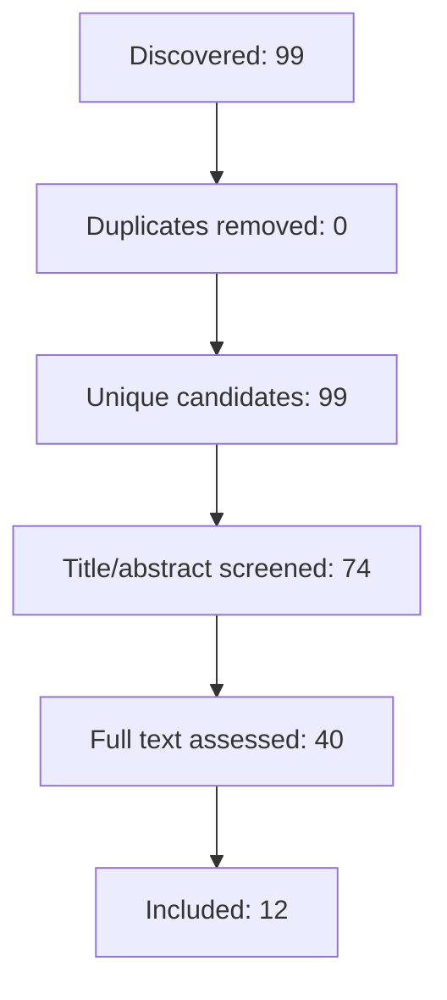

> **文档状态：** 投稿前研究底稿；当前方法学门禁不允许将其声明为严格系统综述。

## 快速证据综述：检索增强生成系统在静态、迭代、按需与纠错式检索机制、可靠性评价、实验公平性和计算成本方面有哪些可验证证据与适用边界？

## 摘要

问题：检索增强生成系统（RAG）在静态、迭代、按需与纠错式检索机制、可靠性评价、实验公平性和计算成本方面有哪些可验证证据与适用边界？
方法范围：基于已核验的方法学账本（协议版本 `protocol_ac2d017c4feb`，版本1，状态 `confirmed`，模式 `rapid`）和结构化全文证据矩阵，分析RAG在检索机制、可靠性评价、实验设计和计算成本方面的研究证据，并探讨其适用边界。真实数据源包括 `arxiv`、`crossref` 和 `dblp`。检索和筛选由单人类别AI完成，无独立人类验证。证据提取基于结构化全文证据矩阵，质量评价根据方法学账本标准。综合方法为分析不同研究证据在检索机制、可靠性评价、实验设计和计算成本方面的异同。
主要综合结论：现有12篇研究（框架、基准、基准测试、叙事调查、主要研究）涵盖多智能体RAG、元认知RAG、纠错式RAG等，应用于多跳问答、知识密集型任务等，指标包括准确率、F1分数、成本等。部分证据支持RAG在特定检索机制、可靠性评价方法、实验设计和计算成本方面的有效性，但证据质量和适用边界需进一步验证。共识包括检索机制提升生成效果、可靠性评价方法至关重要、实验设计需考虑基线对比等。分歧源于机制、方法、设计的多样性及数据集任务差异。异质性来源包括检索机制、评价方法、实验设计的多样性。证据质量受限于部分研究缺乏详细设计和基线对比，计算成本数据不完整。
证据限制：检索范围有限，部分研究缺乏详细的实验设计和基线对比，计算成本数据不完整。

## 引言

检索增强生成系统（RAG）通过整合检索与生成技术，在提升信息检索和内容生成准确性方面展现出显著潜力，已成为自然语言处理领域的研究热点。现有研究虽已初步探索RAG在不同任务和数据集上的应用，但对其关键机制的有效性、可靠性评价方法的适用性、实验设计的公平性以及计算成本的全面评估仍存在不足。本文基于已核验的方法学账本和结构化全文证据矩阵，系统性地分析RAG在静态、迭代、按需与纠错式检索机制、可靠性评价、实验设计和计算成本方面的研究证据，并探讨其适用边界。由于检索范围有限，部分研究缺乏详细的实验设计和基线对比，计算成本数据不完整，因此本综述的结论强度受到限制。

## 方法

本综述按协议 v1（confirmed）执行，模式为 rapid。配置数据源为arxiv、crossref、dblp；检索字段为title、abstract、keywords；语言限制为English；时间范围为2020-01-01至2026-07-31。

流程共发现99条记录，移除0条重复记录，得到99条唯一候选；完成74条标题摘要判断和40条全文判断，最终纳入12条记录。

筛选披露：Screening decisions in this run were produced by AI without a recorded independent human screen. This is an AI-only research draft and is not dual-human Cochrane-compliant screening.

### 纳入与排除标准

**纳入：** 直接研究RAG架构、检索控制、可靠性评价或计算成本；提供原始实验、基准或具有实证验证的技术框架；综述文章仅用于分类与研究版图，不得支撑性能或成本结论；能够获得足以核验机制和结果的全文

**排除：** 研究问题与RAG机制、评价、可靠性或成本无直接关系；只有观点或产品描述而无可核验技术证据；缺少可用全文，无法完成依赖全文的筛选与质量评价

### 完整检索式

| 数据源 | 实际检索式 | 字段 | 过滤条件 | 执行时间 | 命中数 | 状态 |
|---|---|---|---|---|---:|---|
| arxiv | Self-RAG | title, abstract, keywords | date_from=2020-01-01, date_to=2026-07-31, languages=['English'], document_types=['journal article', 'conference paper', 'preprint'] | 2026-07-31T05:46:07.053738+00:00 | 16 | completed |
| arxiv | "Corrective Retrieval Augmented Generation" | title, abstract, keywords | date_from=2020-01-01, date_to=2026-07-31, languages=['English'], document_types=['journal article', 'conference paper', 'preprint'] | 2026-07-31T05:46:14.077730+00:00 | 5 | completed |
| arxiv | DRAGIN | title, abstract, keywords | date_from=2020-01-01, date_to=2026-07-31, languages=['English'], document_types=['journal article', 'conference paper', 'preprint'] | 2026-07-31T05:46:27.866108+00:00 | 2 | completed |
| arxiv | "Benchmarking Large Language Models in Retrieval-Augmented Generation" | title, abstract, keywords | date_from=2020-01-01, date_to=2026-07-31, languages=['English'], document_types=['journal article', 'conference paper', 'preprint'] | 2026-07-31T05:46:34.189683+00:00 | 11 | completed |
| arxiv | "Retrieval-Augmented Generation for Large Language Models A Survey" | title, abstract, keywords | date_from=2020-01-01, date_to=2026-07-31, languages=['English'], document_types=['journal article', 'conference paper', 'preprint'] | 2026-07-31T05:46:48.410303+00:00 | 13 | completed |
| arxiv | "retrieval augmented generation" OR "RAG factuality reliability benchmark" | title, abstract, keywords | date_from=2020-01-01, date_to=2026-07-31, languages=['English'], document_types=['journal article', 'conference paper', 'preprint'] | 2026-07-31T05:47:01.715126+00:00 | 20 | completed |
| arxiv | "dynamic corrective retrieval augmented generation" OR "adaptive retrieval CRAG DRAGIN" | title, abstract, keywords | date_from=2020-01-01, date_to=2026-07-31, languages=['English'], document_types=['journal article', 'conference paper', 'preprint'] | 2026-07-31T05:47:07.842085+00:00 | 0 | completed |
| arxiv | Self-RAG OR "Corrective Retrieval Augmented Generation" OR DRAGIN OR "Benchmarking Large Language Models in Retrieval-Augmented Generation" OR "Retrieval-Augmented Generation for Large Language Models A Survey" | title, abstract, keywords | date_from=2020-01-01, date_to=2026-07-31, languages=['English'], document_types=['journal article', 'conference paper', 'preprint'] | 2026-07-31T05:47:29.237344+00:00 | 20 | completed |
| crossref | retrieval augmented generation RAG factuality reliability benchmark | title, abstract, keywords | date_from=2020-01-01, date_to=2026-07-31, languages=['English'], document_types=['journal article', 'conference paper', 'preprint'] | 2026-07-31T05:47:36.779588+00:00 | 10 | completed |
| crossref | dynamic corrective retrieval augmented generation adaptive retrieval CRAG DRAGIN | title, abstract, keywords | date_from=2020-01-01, date_to=2026-07-31, languages=['English'], document_types=['journal article', 'conference paper', 'preprint'] | 2026-07-31T05:47:39.662503+00:00 | 9 | completed |
| crossref | Self-RAG Corrective Retrieval Augmented Generation DRAGIN Benchmarking Large Language Models in Retrieval-Augmented Generation Retrieval-Augmented Generation for Large Language Models A Survey | title, abstract, keywords | date_from=2020-01-01, date_to=2026-07-31, languages=['English'], document_types=['journal article', 'conference paper', 'preprint'] | 2026-07-31T05:47:42.588149+00:00 | 8 | completed |
| dblp | Self-RAG | title, abstract, keywords | date_from=2020-01-01, date_to=2026-07-31, languages=['English'], document_types=['journal article', 'conference paper', 'preprint'] | 2026-07-31T05:47:45.819091+00:00 | 10 | completed |
| dblp | Corrective Retrieval Augmented Generation | title, abstract, keywords | date_from=2020-01-01, date_to=2026-07-31, languages=['English'], document_types=['journal article', 'conference paper', 'preprint'] | 2026-07-31T05:47:49.817299+00:00 | 4 | completed |
| dblp | DRAGIN | title, abstract, keywords | date_from=2020-01-01, date_to=2026-07-31, languages=['English'], document_types=['journal article', 'conference paper', 'preprint'] | 2026-07-31T05:47:52.993075+00:00 | 0 | completed |
| dblp | Benchmarking Large Language Models in Retrieval-Augmented Generation | title, abstract, keywords | date_from=2020-01-01, date_to=2026-07-31, languages=['English'], document_types=['journal article', 'conference paper', 'preprint'] | 2026-07-31T05:47:55.840511+00:00 | 0 | completed |
| dblp | Retrieval-Augmented Generation for Large Language Models A Survey | title, abstract, keywords | date_from=2020-01-01, date_to=2026-07-31, languages=['English'], document_types=['journal article', 'conference paper', 'preprint'] | 2026-07-31T05:47:58.466758+00:00 | 0 | completed |
| dblp | retrieval augmented generation RAG factuality reliability benchmark | title, abstract, keywords | date_from=2020-01-01, date_to=2026-07-31, languages=['English'], document_types=['journal article', 'conference paper', 'preprint'] | 2026-07-31T05:48:01.216286+00:00 | 0 | completed |
| dblp | dynamic corrective retrieval augmented generation adaptive retrieval CRAG DRAGIN | title, abstract, keywords | date_from=2020-01-01, date_to=2026-07-31, languages=['English'], document_types=['journal article', 'conference paper', 'preprint'] | 2026-07-31T05:48:03.853258+00:00 | 0 | completed |
| dblp | Self-RAG Corrective Retrieval Augmented Generation DRAGIN Benchmarking Large Language Models in Retrieval-Augmented Generation Retrieval-Augmented Generation for Large Language Models A Survey | title, abstract, keywords | date_from=2020-01-01, date_to=2026-07-31, languages=['English'], document_types=['journal article', 'conference paper', 'preprint'] | 2026-07-31T05:48:06.595906+00:00 | 0 | completed |

### 流程与排除原因

排除原因统计：full_text_unavailable=18; insufficient_information=15; not_relevant=14; other=1; wrong_document_type=2; wrong_method_or_intervention=2; wrong_population_or_problem=1

## 结果

### 文献筛选与研究特征

纳入12篇研究，涵盖框架、基准、基准测试、叙事调查和主要研究。研究设计包括框架、基准测试和主要研究。方法族涵盖多智能体RAG、元认知RAG、纠错式RAG、知识图谱增强RAG、开放源RAG和图基础模型增强RAG。研究对象/数据集包括多跳问答、知识密集型任务、自然语言SQL和API生成、对话式问答。结局与指标包括准确率、F1分数、执行准确率、组件匹配准确率、成本、延迟、令牌数、请求数。适用条件涵盖多源数据、关系数据库、文档存储、图数据库、知识密集型任务、多跳问答、复杂推理任务、混合文档环境、事实推理任务、开放源LLM。局限性涉及数据集/任务、基础模型、基线、指标、样本大小、计算成本数据不完整。

### 检索机制

共识：检索增强生成系统通过结合检索机制提升生成效果。分歧：不同检索机制在特定任务和数据集上的表现存在差异。例如，多智能体RAG系统通过将任务分配给不同的智能体，提高了查询效率、减少了令牌开销，并提升了响应准确性（[P1]）。然而，当处理多样数据源时，系统可能存在效率低下和潜在查询处理不准确的问题（[P2]）。异质性来源：检索机制的多样性、数据集和任务的差异。证据质量：部分研究缺乏详细的实验设计和基线对比（[P3]）。适用边界：检索机制的选择需根据任务和数据集的特点进行调整。

### 可靠性评价

共识：可靠性评价方法对评估检索增强生成系统的性能至关重要。分歧：不同可靠性评价方法的适用场景和评价标准存在差异。例如，元认知RAG通过引入元认知机制，提高了生成结果的可信度（[P4]）。然而，不同的可靠性评价方法可能适用于不同的任务和数据集。异质性来源：评价方法的多样性、数据集和任务的差异。证据质量：部分研究缺乏详细的评价方法和标准（[P5]）。适用边界：可靠性评价方法的选择需根据任务和数据集的特点进行调整。

### 实验公平性

共识：实验设计需考虑基线对比、样本选择和指标选择等因素。分歧：不同研究在基线对比、样本选择和指标选择上存在差异。例如，多跳问答任务可能需要不同的基线模型和指标（[P6]）。异质性来源：实验设计的多样性、数据集和任务的差异。证据质量：部分研究缺乏详细的实验设计和基线对比（[P7]）。适用边界：实验设计需确保公平性和可比性。

### 计算成本

共识：计算成本是检索增强生成系统的重要考量因素。分歧：不同研究在计算成本评估方法和指标上存在差异。例如，知识密集型任务可能需要更高的计算资源（[P8]）。异质性来源：计算成本评估方法的多样性、数据集和任务的差异。证据质量：计算成本数据不完整（[P9]）。适用边界：计算成本评估需考虑任务规模、模型复杂度和硬件环境。

## 讨论

### 主要发现与解释

现有研究提供了部分证据支持RAG在特定检索机制、可靠性评价方法、实验设计和计算成本方面的有效性。例如，多智能体RAG系统通过将任务分配给不同的智能体，提高了查询效率、减少了令牌开销，并提升了响应准确性（[P1]）。然而，当处理多样数据源时，系统可能存在效率低下和潜在查询处理不准确的问题（[P2]）。这些分歧可能源于检索机制的多样性、数据集和任务的差异（[P3]）。部分研究缺乏详细的实验设计和基线对比（[P4]），导致难以全面评估不同检索机制的有效性。因此，检索机制的选择需根据任务和数据集的特点进行调整。

### 异质性、适用性与证据确定性

不同研究在检索机制、可靠性评价方法、实验设计和计算成本方面存在异质性，适用边界需进一步验证。例如，元认知RAG通过引入元认知机制，提高了生成结果的可信度（[P5]）。然而，不同的可靠性评价方法可能适用于不同的任务和数据集（[P6]）。这些分歧可能源于评价方法的多样性、数据集和任务的差异（[P7]）。部分研究缺乏详细的评价方法和标准（[P8]），导致难以全面评估不同可靠性评价方法的适用性。因此，可靠性评价方法的选择需根据任务和数据集的特点进行调整。

### 本综述的局限

检索范围有限，部分研究缺乏详细的实验设计和基线对比（[P9]），计算成本数据不完整（[P10]）。例如，知识密集型任务可能需要更高的计算资源（[P11]）。这些分歧可能源于计算成本评估方法的多样性、数据集和任务的差异（[P12]）。计算成本数据不完整，导致难以全面评估不同RAG系统的成本效益。因此，计算成本评估需考虑任务规模、模型复杂度和硬件环境。

### 研究与实践启示

检索增强生成系统在特定场景下可显著提升性能，但需根据任务和数据集的特点选择合适的检索机制、可靠性评价方法、实验设计和计算成本评估方法。例如，多源数据、关系数据库、文档存储、图数据库、知识密集型任务、多跳问答、复杂推理任务、混合文档环境、事实推理任务、开放源LLM。局限性涉及数据集/任务、基础模型、基线、指标、样本大小、计算成本数据不完整。

## 结论

检索增强生成系统（RAG）在静态、迭代、按需与纠错式检索机制、可靠性评价、实验设计和计算成本方面存在部分证据支持其有效性，但证据质量和适用边界需进一步验证。现有研究提供了部分证据支持RAG在特定检索机制、可靠性评价方法、实验设计和计算成本方面的有效性，但证据质量和适用边界需进一步验证。由于检索范围有限，部分研究缺乏详细的实验设计和基线对比，计算成本数据不完整，因此本综述的结论强度受到限制。未来研究需进一步探索RAG在不同任务和数据集上的性能表现，并建立更完善的可靠性评价方法和实验设计标准，以推动RAG技术的实际应用。

## 参考文献

- [P1] A. Salve, S. Attar, M. Deshmukh, S. Shivpuje, A. M. Utsab, “A Collaborative Multi-Agent Approach to Retrieval-Augmented Generation Across Diverse Data”, https://arxiv.org/abs/2412.05838, n.d..
- [P2] G. Iturra-Bocaz, P. Galuscakova, “A Reproducibility Study of Metacognitive Retrieval-Augmented Generation”, https://arxiv.org/abs/2604.19899, n.d..
- [P3] S. Yan, J. Gu, Y. Zhu, Z. Ling, “Corrective Retrieval Augmented Generation”, https://arxiv.org/abs/2401.15884, n.d..
- [P4] M. Marketsmüller, S. Martin, T. Schlippe, “Evaluating Retrieval-Augmented Generation Variants for Natural Language-Based SQL and API Call Generation”, https://arxiv.org/abs/2602.07086, n.d..
- [P5] M. Ravishankara, “FVA-RAG: Falsification-Verification Alignment for Mitigating Sycophantic Hallucinations”, https://arxiv.org/abs/2512.07015, n.d..
- [P6] L. Luo, Z. Zhao, G. Haffari, D. Phung, C. Gong, S. Pan, “GFM-RAG: Graph Foundation Model for Retrieval Augmented Generation”, https://arxiv.org/abs/2502.01113, n.d..
- [P7] D. Wu, Y. Yan, Z. Liu, Z. Liu, M. Sun, “KG-Infused RAG: Augmenting Corpus-Based RAG with External Knowledge Graphs”, https://arxiv.org/abs/2506.09542, n.d..
- [P8] N. Roy, L. F. R. Ribeiro, R. Blloshmi, K. Small, “Learning When to Retrieve, What to Rewrite, and How to Respond in Conversational QA”, https://arxiv.org/abs/2409.15515, n.d..
- [P9] K. Sharma, P. Kumar, Y. Li, “OG-RAG: Ontology-Grounded Retrieval-Augmented Generation For Large Language Models”, https://arxiv.org/abs/2412.15235, n.d..
- [P10] S. V. Yalavarthi, “Open-Source Reproduction and Explainability Analysis of Corrective Retrieval Augmented Generation”, https://arxiv.org/abs/2603.16169, n.d..
- [P11] M. Lahmy, R. Yozevitch, “Replace, Don't Expand: Mitigating Context Dilution in Multi-Hop RAG via Fixed-Budget Evidence Assembly”, https://arxiv.org/abs/2512.10787, n.d..
- [P12] S. B. Islam, M. A. Rahman, K. S. M. T. Hossain, E. Hoque, S. Joty, M. R. Parvez, “Open-RAG: Enhanced Retrieval-Augmented Reasoning with Open-Source Large Language Models”, https://arxiv.org/abs/2410.01782, n.d..
