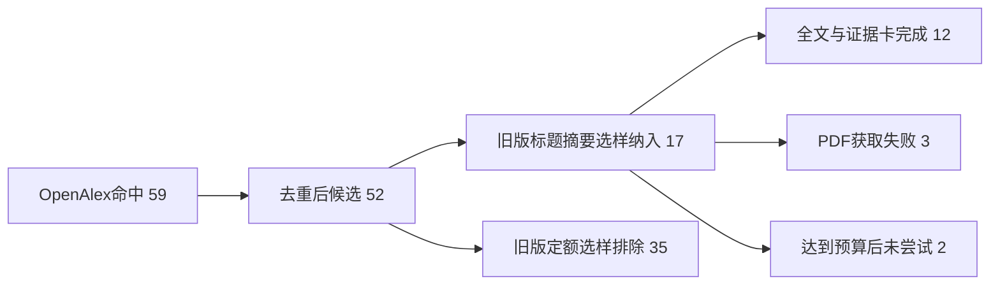
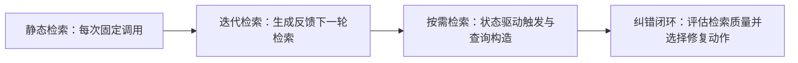

# 检索增强生成的架构、评价与可靠性技术证据综述

> **输出标签：计算机与AI技术证据综述（研究草稿）**
> 本文不是严格系统综述。它是对旧版52条RAG候选记录的可审计重建；由于原运行未保存检索时间、字段映射、完整过滤器、独立盲审与人工裁决记录，方法门禁不允许升级为“系统综述”。

## 摘要

本综述考察检索增强生成（RAG）在静态检索、迭代检索、按需检索、检索评估与纠错、领域适配及可靠性评价方面的证据。旧流程在OpenAlex运行三条主题查询，得到59条来源命中并去重为52条候选；旧版定额选样将17条送入全文获取，最终12条形成全文证据卡，其中9条为一级研究或带实证验证的框架，3条为二级综述。二级综述仅用于技术分类与研究版图，不用于证明性能数字、成本或部署建议。

现有一级证据显示，动态与纠错式RAG的价值来自对“何时检索、检索什么、检索结果是否可信以及错误后采取何种动作”的显式控制。DRAGIN把触发决策与查询构造分别交给RIND和QFS；CRAG使用轻量评估器路由正确、错误与模糊状态，并通过知识精炼或外部搜索进行纠错。它们同时引入新的失败传播路径：触发器漏判、查询漂移、评估器误路由、外部搜索偏差以及额外延迟。当前跨研究结果高度异质，数字往往缺少统一基线、硬件或语料规模，因此不支持“复杂任务应一律采用动态RAG”之类无条件结论。更稳妥的工程判断是：先诊断静态检索的具体失败，再在任务收益、控制器可观测性和延迟预算允许时引入迭代或闭环纠错。

## 1. 引言

RAG把外部证据接入生成过程，但“接入检索”本身并不保证真实、完整或高效。检索可能返回无关、矛盾或误导性材料；生成器也可能忽略证据、过度依赖证据或错误整合多个片段。因而，技术综述不能只列举方法名称，而应比较控制机制、实验证据、适用条件、失败传播和工程代价。

本文将RAG理解为由检索、证据处理、生成和控制策略组成的系统。只有具备明确目标、内部状态、可选择动作及反馈闭环时才使用“Agent”标签；DRAGIN和CRAG在本文中分别称为按需检索框架与纠错闭环，而不因具有自适应行为就自动称为Agent。

## 2. 方法

### 2.1 研究问题与证据层级

研究问题为：检索增强生成系统在检索器—生成器耦合、训练方式、评价框架、事实可靠性与计算成本方面有哪些主要技术路线和证据边界？

证据分为一级与二级。P1、P6和P12是综述或分类文章，仅用于背景、分类与研究版图；P2–P5、P7–P11用于机制、性能、成本和条件性实践结论。若二级综述提及性能数字，正式论断必须回溯原始研究。

### 2.2 检索策略与可复现性边界

归档账本保存了OpenAlex中的三条原始检索式：

1. `retrieval augmented generation language models`
2. `RAG evaluation factuality reliability benchmark`
3. `self retrieval corrective retrieval augmented generation`

三条查询分别返回20、20和19条记录，合计59条；按归档候选池去重后为52条，即移除7条重复记录。旧流程没有保存执行时间、字段限定、时间范围、语言、文献类型过滤、游标和重试次数。本次升级不推断或补写这些信息，完整结构化账本见 `search_ledger_v2.json`。

### 2.3 筛选与全文

旧版不是按预先确认的逐条纳排标准进行双人筛选，而是模型相关性排序后进行定额选样。本次从归档恢复出52条标题摘要决定：17条进入全文阶段，35条因未进入旧版目标样本而排除；这35条排除反映旧工作流，不应被解释为科学上的不相关。17条中，12条成功获得全文并提取证据，3条因HTTP 403未获得全文，2条在达到旧版目标后未尝试下载。

筛选流程由模型参与，但没有保存独立于人工决定的盲审记录，也没有分歧裁决。因此本文明确披露AI参与，且不宣称达到双人类独立筛选标准。要升级标签，必须从52条候选重新执行标题摘要筛选、全文筛选、AI盲审与人工裁决。

### 2.4 提取、评价与综合

证据卡记录研究类型、任务或数据集、模型、方法、主要结果、限制和页码。升级后的Schema还要求输入、内部状态、决策函数、阈值、触发粒度、后续动作、融合方式、失败传播，以及每个数字的数据集、模型、检索器、基线、指标、变化类型、显著性、硬件和证据位置。旧证据卡缺失的字段统一标记“未报告/无法验证”。

由于任务、模型、数据集与指标不可直接合并，本文采用非荟萃的结构化综合：先按机制分组，再分别回答为何有效、何时失效、证据来自何种任务以及工程代价。没有进行确定性荟萃分析。

## 3. 结构化证据

### 表1：纳入研究基本信息

| 文献 | 年份 | 证据层级 | 任务/数据集 | 基础模型或组件 | 方法族 |
|---|---:|---|---|---|---|
| P1 | 2023 | 二级（narrative_survey） | RAG研究版图 | 多类LLM/检索器 | 分类综述 |
| P2 | 2023 | 一级（primary_study） | 6个QA与推理数据集 | LLaMA-2 13B/70B等 | 迭代检索 |
| P3 | 2024 | 一级（framework） | 2Wiki、Hotpot、IIRC、StrategyQA | Transformer LLM；BM25/SGPT | 按需检索 |
| P4 | 2023 | 一级（benchmark） | RGB；英中双语 | 多种LLM | 可靠性基准 |
| P5 | 2024 | 一级（benchmark） | MIRAGE医学QA | 6种LLM与多检索器 | 领域基准 |
| P6 | 2026 | 二级（narrative_survey） | 文本RAG研究版图 | 多类模型 | 分类综述 |
| P7 | 2024 | 一级（primary_study） | IU-Xray、Harvard、MIMIC | LLaVA-Med 1.5 7B | 多模态可靠RAG |
| P8 | 2024 | 一级（primary_study） | PopQA、Biography、PubHealth、Arc | T5-large、Contriever、LLaMA2 | 检索纠错 |
| P9 | 2024 | 一级（primary_study） | CMU 34,781条QA | LLaMA-2、BGE Reranker | 领域RAG |
| P10 | 2025 | 一级（framework） | ASQA等 | 2,000训练样本 | 自推理RAG |
| P11 | 2025 | 一级（primary_study） | 500条真实/合成COVID声明 | GPT-4、Qdrant | 事实核查 |
| P12 | 2024 | 二级（narrative_survey） | 多模态RAG研究版图 | 多类模型 | 分类综述 |

### 表2：架构机制比较

| 方法 | 检索触发 | 查询构造/内部状态 | 是否迭代 | 纠错与融合 | 主要开销与失败传播 |
|---|---|---|---|---|---|
| 静态RAG | 每次请求固定触发 | 原始用户查询 | 否 | 检索片段直接进入上下文 | 低控制开销；检索错误直接污染生成 |
| ITER-RETGEN（P2） | 每轮生成后 | 用生成输出增强下一轮检索 | 是 | 新检索结果继续修正生成 | 迭代增加调用；错误生成可能形成查询漂移 |
| DRAGIN（P3） | RIND根据不确定性、语义重要性与token影响判断 | QFS利用整个上下文的自注意力形成查询 | 是，按需 | 新证据进入后续生成步骤 | 需访问注意力；API不可见时不能直接使用；错误触发会漏检或过检 |
| CRAG（P8） | T5评估器给出正确/错误/模糊状态 | 评估检索文档质量 | 条件性 | 正确时知识精炼；错误/模糊时外部搜索，再分解重组 | 依赖外部搜索；路由误判会触发错误分支；报告更高FLOPs与执行时间 |
| SELF-REASONING（P10） | RAP/EAP/TAP阶段性控制 | 相关性、证据选择与轨迹分析 | 是 | 对证据与推理轨迹联合约束 | 需额外训练数据与辅助模型；训练数据来自GPT-4 |

### 表3：评价指标、定量结果与证据边界

| 文献 | 数据集/设置 | 基线 | 指标与结果 | 变化类型 | 证据边界 |
|---|---|---|---|---|---|
| P2 | 6个QA/推理数据集中的4个 | SOTA RAG基线，当前提取未绑定到单一实验行 | 最高8.6% | 原文称absolute gain | 不能在摘要中泛化；需回查逐数据集、模型与基线 |
| P4 | RGB英/中设置 | 多种LLM | 最高负面拒绝率45%/43.33%；合并/忽略错误各28% | 原始比例 | 衡量特定基准可靠性，不代表所有RAG |
| P7 | 医学VQA与报告生成 | 多个医学VLM基线，当前提取不完整 | 平均准确率提升47.4%；ORR约47%→27% | 47.4%的相对/绝对含义未完成核验；ORR为绝对下降约20个百分点 | 47.4%禁止进入摘要和部署建议 |
| P8 | PopQA、Biography、PubHealth、Arc；A800 80GB成本实验 | RAG、Self-RAG等 | 评估器84.3% vs ChatGPT 58.0%；26.5→27.2 FLOPs/token；0.363→0.512 s | 研究内对比 | 时间是研究内局部设置；缺少跨研究统一端到端延迟、显存、吞吐与价格 |
| P9 | CMU 34,781 QA | 无RAG/原检索器 | Recall 0.361→0.452 | 绝对+0.091 | 单一私有知识库案例，外部有效性有限 |
| P10 | ASQA | GPT-4 | citation recall 72.3 vs 68.5 | 绝对+3.8个百分点 | 仅限该任务和引用指标 |
| P11 | 500条真实/合成COVID声明 | GPT-4与较简单RAG | CRAG/SRAG真实声明准确率0.972/0.973；合成声明最高0.978 | 研究内绝对准确率 | 未报告端到端延迟、内存和逐查询成本 |

### 图1：控制能力递增的RAG技术谱系

该图表示控制机制的递增，不代表越靠右就必然更好；更多控制也意味着更多状态估计误差、依赖和成本。

## 4. 技术综合

### 4.1 静态与迭代耦合

静态RAG的优势是路径短、行为易观测，但检索错误会直接进入生成上下文。P2的ITER-RETGEN让生成输出参与下一轮检索，使后续证据能够补足早期查询的信息缺口。其有效性依赖于中间生成是否包含有用概念；若早期生成错误，查询可能沿错误方向漂移。原文在六个任务中的四个报告最高8.6%的绝对增益，但当前提取没有把该最大值绑定到唯一数据集、模型和基线实验行，因此本数字只保留在证据边界表，不进入摘要或一般部署建议。

P9的领域案例显示，在其私有知识库设置中，加入RAG后Recall从0.361升至0.452，并观察到微调嵌入模型有益、在小而偏的数据上微调生成器可能造成冗长和重复。该结果支持“先优化检索侧”的条件性假设，但单一案例不足以形成普遍优先顺序。

### 4.2 DRAGIN：实时需求检测与查询构造

DRAGIN把动态检索分成两个问题。RIND估计当前生成是否存在实时信息需求，组合不确定性、语义重要性与token影响决定是否触发；QFS再利用整个上下文的自注意力权重构造查询，而不是只取最近一句。触发发生在生成过程中，目标是避免固定间隔检索造成的过度调用，同时在知识缺口出现时补充证据。

该机制为何可能有效：触发决策同时考虑“模型不确定”“当前token重要”和“该位置会影响后续生成”，查询又利用全局上下文减少局部关键词偏差。其失败条件也很明确：商业API若不暴露自注意力，QFS无法直接复现；RIND阈值漏判会错过必要检索，过度敏感则增加延迟并引入噪声；由错误上下文形成的查询仍可能放大偏差。P3在2WikiMultiHopQA、HotpotQA、IIRC和StrategyQA等设置中报告优于比较方法，并观察到BM25在这些动态实验中优于SGPT。这是任务与配置相关结果，不应改写成“BM25普遍优于稠密检索”。

### 4.3 CRAG：检索评价、路由与知识精炼

CRAG在生成前加入轻量T5检索评估器，对检索文档形成质量判断，并路由到正确、错误或模糊状态。正确分支对内部文档做分解—重组，抽取有用片段并过滤无关内容；错误分支扩大到外部网页检索；模糊分支保留并补充多路证据。内部检索与外部结果在知识精炼后进入生成器，而不是简单拼接所有文本。

该框架把“是否相信检索结果”变成显式控制点，因而能在原检索失败时获得第二条证据路径。但评估器误判会传播到后续动作：把错误结果判为正确会阻止外部纠错，把正确结果判为错误会引入额外噪声和成本，模糊状态过多则退化为频繁搜索。P8报告其T5评估器准确率84.3%，对应ChatGPT比较值58.0%；该比较只说明论文中的评估器任务，不代表一般问答质量。

成本方面，P8在NVIDIA A800 80GB的研究内设置报告RAG到CRAG的FLOPs/token由26.5增至27.2，执行时间由0.363 s增至0.512 s。这里的“执行时间”是原研究特定实现的局部对比。更准确的跨研究结论是：已有个别研究报告局部成本，但缺少统一硬件、语料规模和服务条件下的端到端延迟、峰值显存、吞吐量与价格比较；这与P8存在时间数据并不矛盾。

### 4.4 可靠性评价与领域边界

P4的RGB基准表明，RAG可靠性至少包括噪声鲁棒、负面拒绝、信息整合与反事实鲁棒，而不应只看答案准确率。其英中设置下最高负面拒绝率分别为45%和43.33%，并观察到合并错误、忽略错误等具体模式。P5进一步显示医学RAG受证据位置影响，存在lost-in-the-middle现象；这意味着增加检索片段不必然单调改善结果。

P7在医学视觉语言任务中通过Factuality Risk Control选择检索数量，并用Knowledge Balanced Preference Tuning缓解外部证据过度依赖。其ORR由约47%降至27%，但“平均准确率提升47.4%”在现有提取中没有明确相对增幅还是百分点变化，也没有完整绑定逐任务基线，因此被门禁阻止进入摘要和结论。

P10通过RAP、EAP和TAP分别处理相关性、证据选择和推理轨迹，在ASQA上报告citation recall 72.3，对应GPT-4的68.5。P11在500条真实与合成COVID声明的研究内设置报告CRAG/SRAG较高准确率，但没有报告端到端延迟、内存和逐查询成本，因而不能仅据准确率判断部署优劣。

## 5. 讨论

### 5.1 可泛化结论

第一，RAG改进的核心并非“检索次数越多越好”，而是控制何时检索、如何形成查询、如何评价证据及如何处理检索失败。第二，动态与纠错机制把部分错误从不可见的生成过程转为可观测的控制决策，但也新增触发器、路由器和外部工具的失败面。第三，可靠性评价必须同时覆盖拒答、证据忠实性、矛盾整合、引用与成本，而非只报告最终准确率。

### 5.2 条件性工程建议

对于可由一次高质量检索覆盖、延迟敏感且错误成本较低的任务，可先采用静态RAG并加强查询改写、重排序和上下文压缩。只有在错误分析显示知识需求会随生成变化、或初始检索经常失效时，才考虑迭代或按需检索。引入CRAG式纠错前，应单独验证评估器的校准、三种状态的阈值、外部搜索失败策略和成本上限。上述建议的确定性为低至中等，因为研究之间缺少统一实验设计。

### 5.3 证据缺口

当前主要缺口包括：统一硬件下的端到端延迟、显存、吞吐和价格；触发阈值的校准曲线；控制器误判的误差传播；不同检索语料规模下的稳定性；以及对数据泄漏、方差、显著性和外部有效性的统一报告。现有纳入证据也偏重开放获取且能成功下载的论文，旧版定额选样可能遗漏相关研究。

### 5.4 方法学限制

本回归案例的最大限制不是写作，而是历史账本缺失。虽然52→12的数量现已能够确定性对账，35条“排除”实际表示未进入旧版目标样本，而非按协议确认不符合纳入标准。因此，本文只能作为结构化技术证据综述草稿与错误夹具，不能作为系统综述成稿。

## 6. 结论

现有证据支持把RAG理解为从静态管道向具有按需控制和反馈纠错能力的闭环系统演进，而不是笼统地向“Agent”演进。迭代、动态和纠错机制在特定任务中能够改善表现，但收益依赖任务、模型、检索器和控制器质量，并伴随新的误差传播与计算成本。实践中应先明确静态RAG的失败类型，再按证据与预算逐步增加控制复杂度。由于本案例缺失关键历史方法元数据和独立筛选记录，正式结论仍需在新版协议下重新检索与筛选后确认。

## 参考文献

[1] Yunfan Gao, Yun Xiong, Xinyu Gao, et al., “Retrieval-Augmented Generation for Large Language Models: A Survey,” 2023. https://doi.org/10.48550/arxiv.2312.10997
[2] Zhihong Shao, Yeyun Gong, Yelong Shen, et al., “Enhancing Retrieval-Augmented Large Language Models with Iterative Retrieval-Generation Synergy,” 2023. https://doi.org/10.18653/v1/2023.findings-emnlp.620
[3] Weihang Su, Yichen Tang, Qingyao Ai, et al., “DRAGIN: Dynamic Retrieval Augmented Generation based on the Real-time Information Needs of Large Language Models,” 2024. https://doi.org/10.18653/v1/2024.acl-long.702
[4] Jiawei Chen, Hongyu Lin, Xianpei Han, et al., “Benchmarking Large Language Models in Retrieval-Augmented Generation,” 2023. https://doi.org/10.48550/arxiv.2309.01431
[5] Guangzhi Xiong, Qiao Jin, Zhiyong Lu, et al., “Benchmarking Retrieval-Augmented Generation for Medicine,” 2024. https://doi.org/10.18653/v1/2024.findings-acl.372
[6] Yizheng Huang, Jimmy Xiangji Huang, “A Survey on Retrieval-Augmented Text Generation for Large Language Models,” 2026. https://doi.org/10.1145/3805774
[7] Peng Xia, Kangyu Zhu, Haoran Li, et al., “RULE: Reliable Multimodal RAG for Factuality in Medical Vision Language Models,” 2024. https://doi.org/10.18653/v1/2024.emnlp-main.62
[8] Shi-Qi Yan, Jia-Chen Gu, Yun Zhu, et al., “Corrective Retrieval Augmented Generation,” 2024. https://doi.org/10.48550/arxiv.2401.15884
[9] Jiarui Li, Ye Yuan, Zehua Zhang, “Enhancing LLM Factual Accuracy with RAG to Counter Hallucinations: A Case Study on Domain-Specific Queries in Private Knowledge-Bases,” 2024. https://doi.org/10.48550/arxiv.2403.10446
[10] Yuan Xia, Jingbo Zhou, Zhenhui Shi, et al., “Improving Retrieval Augmented Language Model with Self-Reasoning,” 2025. https://doi.org/10.1609/aaai.v39i24.34743
[11] Hai Li, Jingyi Huang, Mengmeng Ji, et al., “Use of Retrieval-Augmented Large Language Model for COVID-19 Fact-Checking: Development and Usability Study,” 2025. https://doi.org/10.2196/66098
[12] Penghao Zhao, Hailin Zhang, Qinhan Yu, et al., “Retrieval-Augmented Generation for AI-Generated Content: A Survey,” 2024. https://doi.org/10.48550/arxiv.2402.19473

## 附录A：完整检索式与执行记录

| 数据源 | 原始/实际检索式 | 命中 | 执行时间 | 字段范围 | 过滤器 |
|---|---|---:|---|---|---|
| OpenAlex | `retrieval augmented generation language models` | 20 | 未记录 | 未记录 | 日期、语言、类型均未记录 |
| OpenAlex | `RAG evaluation factuality reliability benchmark` | 20 | 未记录 | 未记录 | 日期、语言、类型均未记录 |
| OpenAlex | `self retrieval corrective retrieval augmented generation` | 19 | 未记录 | 未记录 | 日期、语言、类型均未记录 |

## 附录B：流程对账

- 来源命中：59
- 重复记录：7
- 去重候选：52
- 标题摘要进入全文：17
- 旧版定额选样排除：35
- 全文成功并纳入：12
- 全文下载失败：3
- 达到旧版预算后未尝试：2

全部计数满足：59−7=52；17+35=52；12+3+2=17。
